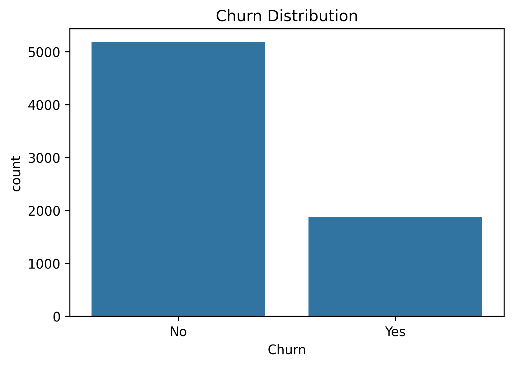
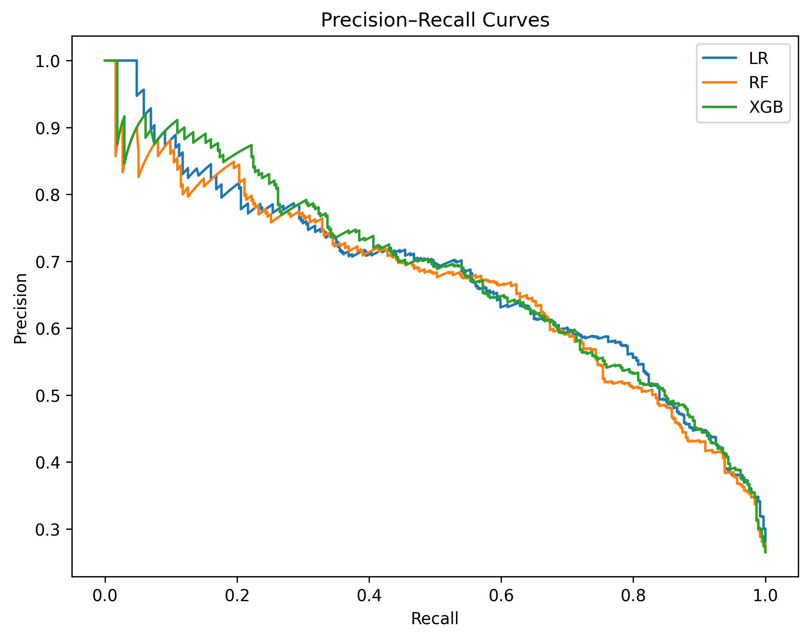
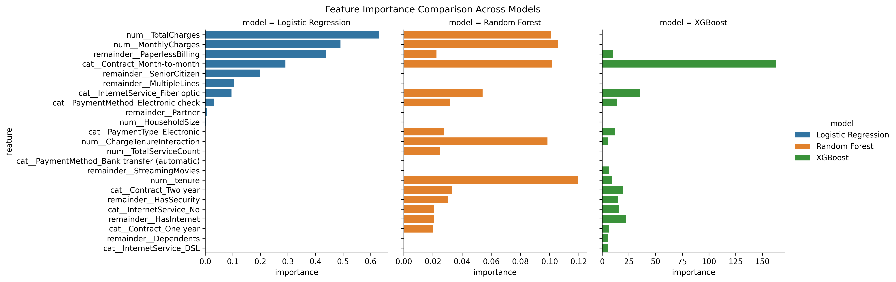

# Customer Churn Prediction

This project focuses on building machine learning models to predict customer churn based on historical customer data. The goal is to identify customers at risk of leaving and support proactive retention strategies.

---

## Project Overview

Customer churn is a critical business problem, especially in subscription-based services. The objective of this project is to develop predictive models that can accurately identify customers likely to churn, allowing the business to take targeted retention actions.

Given the strong class imbalance in the dataset, special focus is placed on evaluation metrics such as recall, precision, F1-score, and PR-AUC rather than accuracy alone.

---

## Project Structure
```
├── data/
│ └── PreprocessedData.csv
│ └── WA_Fn-UseC_-Telco-Customer-Churn.csv
│
├── models/
│ ├── logreg_best_model.pkl
│ ├── logreg_best_threshold.pkl
│ ├── rf_best_model.pkl
│ ├── rf_best_threshold.pkl
│ ├── xgb_best_model.pkl
│ └── xgb_best_threshold.pkl
│
├── notebooks/
│ ├── 01_data_exploration.ipynb
│ ├── 02_preprocessing.ipynb
│ ├── 03_modeling.ipynb
│ └── 04_evaluation.ipynb
│
├── reports/
│ └── figures/
│   ├── pr_curves.png
│   ├── feature_importance.png
│   └── churn_distributions.png
│
└── README.md

```
---

## Dataset Description
This project uses the **Telco Customer Churn** dataset from Kaggle:

Source: https://www.kaggle.com/datasets/blastchar/telco-customer-churn

The dataset contains information about customers of a telecommunications company, including their demographics, account details, subscribed services, and billing information. The target variable **Churn** indicates whether the customer discontinued their service.


### Key Feature Groups
- **Customer Demographics**  
  - SeniorCitizen  
  - Gender  
  - Partner, Dependents  

- **Account Information**  
  - Tenure  
  - Contract type (Month-to-month, One year, Two year)  
  - PaperlessBilling  
  - PaymentMethod  

- **Service Usage**  
  - InternetService (DSL, Fiber optic, None)  
  - OnlineSecurity, OnlineBackup, TechSupport  
  - StreamingTV, StreamingMovies  

- **Financial Attributes**  
  - MonthlyCharges  
  - TotalCharges  

### Target Variable
- **Churn** (0 = stayed, 1 = churned)

The dataset is **highly imbalanced**, with churners representing only a small minority of customers.  
This imbalance strongly influences model selection, evaluation metrics, and threshold tuning. 
Below is a visualization of the churn distribution:




---

## Workflow

### 1. Exploratory Data Analysis
Initial exploration of customer demographics, service usage, and contract types to understand churn patterns.

---

### 2. Data Preparation
- One‑hot encoding for categorical variables
- Interaction features (e.g., Charge × Tenure)
- Preprocessing pipeline built using ColumnTransformer
---

### 3. Modelling

- Stratified train/validation/test split

- Three model families trained:
  - Logistic Regression (interpretable baseline)
  - Random Forest (non‑linear ensemble)
  - XGBoost (gradient boosting, strongest performance)

- Hyperparameter Tuning
  - Performed using GridSearchCV with average_precision (PR‑AUC), the most informative metric for imbalanced datasets.
- Threshold Optimization
  - Instead of using the default 0.5 threshold, optimal thresholds were selected to maximize recall and F1‑score, which are critical for churn detection.

---

### 4. Model Evaluation
Models were evaluated on an unseen test set using:

- Default threshold (0.5)

- Optimized threshold (model‑specific)

Evaluation included:

- Precision, recall, F1‑score
- ROC‑AUC and PR‑AUC
- Confusion matrices
- Precision–Recall curves
- Feature importance across all models



---

## Results Summary

- XGBoost achieved the strongest overall performance, especially after threshold tuning.
- Logistic Regression performed surprisingly well, offering interpretability with competitive metrics.
- Random Forest performed slightly worse but still captured meaningful non‑linear patterns.
- Threshold tuning significantly increased recall (≈0.84 for LR and XGB), which is essential for catching churners.
- PR‑AUC remained stable across models, indicating consistent ranking ability.

---

## Feature Importance Insights

Across all models, the same features consistently drive churn:

- Contract type (Month‑to‑month) — strongest churn indicator
- Internet service type (Fiber optic) — associated with higher churn
- MonthlyCharges and TotalCharges — higher charges correlate with churn
- Tenure — short‑tenure customers are more likely to churn
- PaperlessBilling and SeniorCitizen — moderate contributors

XGBoost showed the strongest feature importance signals, with contract type and internet service dominating its gain‑based importance.



---

## Final Model

The final selected model is:
XGBoost with an optimized threshold

Chosen because it offers:
- Highest recall (~0.84)
- Strong F1‑score (~0.64)
- Stable PR‑AUC
- Clear feature importance patterns
- Ability to capture non‑linear relationships

Logistic Regression remains a strong interpretable alternative.

---

## Dependencies

- pandas
- numpy
- scikit-learn
- xgboost
- matplotlib
- seaborn
- joblib

---

## 🚀 Future Improvements

- Cost‑sensitive learning to incorporate business costs of false negatives vs. false positives.
- SMOTE or hybrid resampling to test whether oversampling improves minority class representation.
- A/B testing of retention strategies triggered by the model.
- Combine churn risk with customer lifetime value (CLV) to prioritize high‑value customers.
- Model monitoring to detect drift in churn behavior over time.
---
